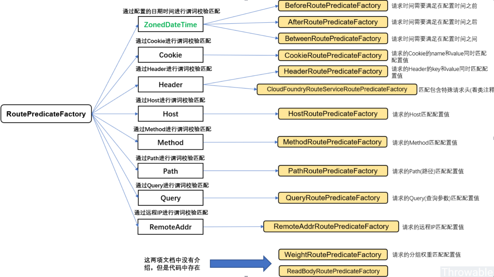

gateway最重要的几个概念

1.Route(路由)：这是网关的基本构建块，它由一个ID，一个URI，一组断言和一组过滤器定义。如果断言为真，则路由匹配。

2.Predicate（断言）：输入类类是一个ServerWebExchange。我们可以使用它来匹配来自HTTP请求的任何内容，例如headers。如果请求与断言相匹配则进行路由。

3.Filter（过滤器）：Spring框架中GatewayFilter的实例，使用过滤器，可以在请求被路由前或者后对请求进行修改。

1.1: http://localhost:8001/payment/get/1的访问，
但是我们访问的时候是将我们的端口8001，暴露在了外边，不安全，但是我们不想暴露真的8001端口号，希望在外面8001外边包上一层我们的Gateway的端口9527，这就需要在yml配置新增路由配置.

2.1: 有11种断言的配置，大家可以根据自己的需求进行配置。(application.yml)

3.1: 

————————————————
版权声明：本文为CSDN博主「一直Tom猫」的原创文章，遵循CC 4.0 BY-SA版权协议，转载请附上原文出处链接及本声明。
原文链接：https://blog.csdn.net/weixin_38007185/article/details/108440631